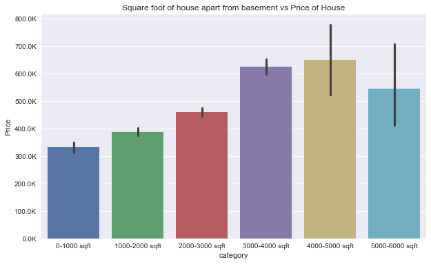

## Final Project Submission

## King County Analysis

## Author: Vinayak Modgil

## Overview: 
This project uses Multiple Linear Regression to find the best parameters suitable for maximum house prices.

## Business Problem:
Potential real estate tycoons are looking to purchase houses so that they can sell it out to future house owners. You are equipped with the data and you need to advise the stakeholders on the affect of different parameters that affect the value of houses in the King County.

## Data
Data of nearly 21000 houses in KC is given from which 15000 houses have quality data.

## Methods:
We use machine learning model of Multiple Linear Regression to find the best fit line for the given data.

## Results

Maximum prices tend towards large sqft above ground (4000-5000).

High graded houses usually have higher prices.

Larger houses with High grade scores are more expensive

The pricing of houses in KC is linearly related with large houses having a basement

## The following conclusions can be drawn from our analysis:
- The area above the basement is key when purchasing houses. The main area to focus is on purchasing houses with adequate amount of area excluding the basement.
- Basements also do play a key role in valuing houses in King County. If a house has a basement, it tends to have more value.
- Grading done according to the KC grading system plays a significant role in valuing houses in KC.

## Here are the recommendations based on our findings:
>- Firstly, we recommend purchasing houses with 4000-5000 sqft area above basement, as they hold the most value.
>- Secondly, purchasing houses with 4000-5000 sqft and having a basement will hold tremendous value in the future.
>- Lastly, Highly scored houses (according to KC grading system) but not the largest (in terms of sqft above ground) will be profitable while selling the houses to future house owners.

## For more Information

See the full analysis in <a href="https://github.com/vinayakmodgil/dsc-phase-2-project/blob/master/student.ipynb">Jupyter Notebook</a>  or review this <a href="https://github.com/vinayakmodgil/dsc-phase-2-project/blob/master/presentation.pdf">presentation</a>.

For additional info, contact Vinayak Modgil at vinayak.modgil@gmail.com

## Repository Structure
├── data
├── images
├── README.md
├── presentation.pdf
└── student

